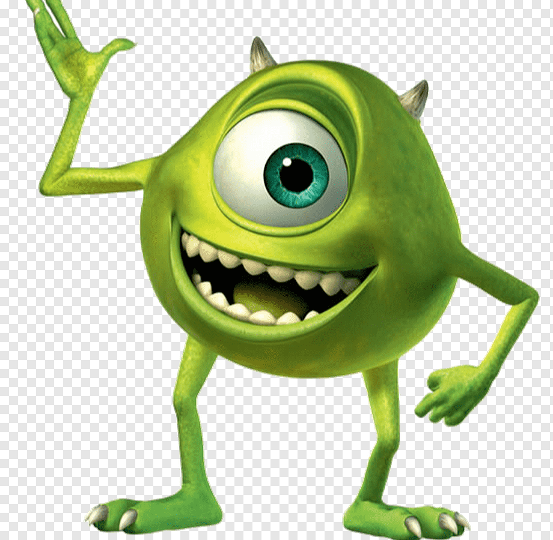
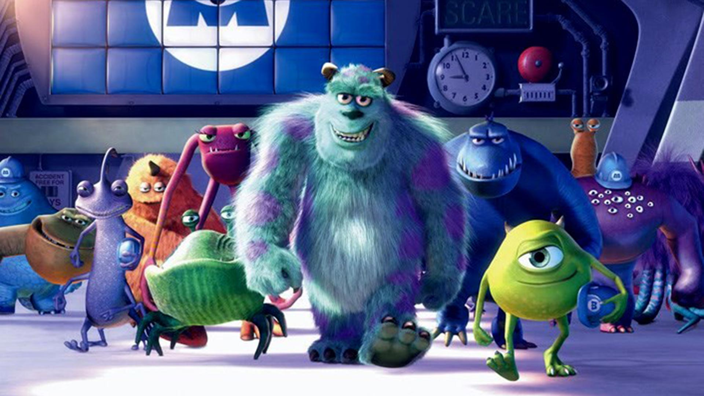

# RMackdown

En este repositorio se almacena el código y los archivos del curso de RMackdown del programa New Dimensions. Aquí va mi siguiente párrafo. Trabajando desde el ***visual***.

Este es el tercer párrafo.\
Este es un cuarto párrafo sin espacio.\
Este es un quinto párrafo sin esoacio.\

Los profesores del New Dimensions son:

-   Diana
-   Ángel
-   Zulemma
-   Christian
-   Dennise

Esta palabra está en **negrita**. Otra forma de poner **negrita** .

La *cursiva*, en cambio, es con un solo asterísco.

Necesito tres, ***asteriscos para que esté en negrita y cursiva a la vez.***

# Insertamos una imagen

La página web de New Dimensions es <https://newdimensions.academy/>\
También puedes ingresar haciendo clic [aquí](https://newdimensions.academy/).

# Título

## Subtítulo 1

### Subtítulo 2

